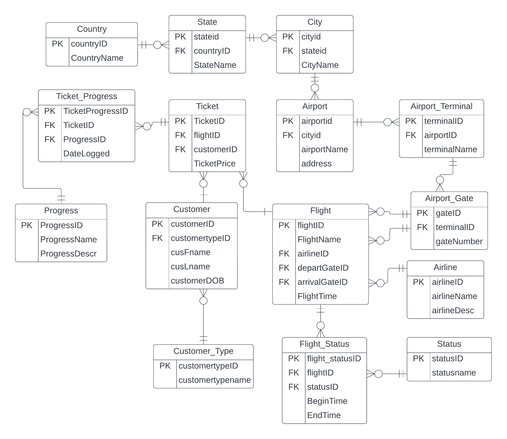

# sql-flights
 Stored procedures, insert procedures, business rules, synthetic transactions, complex queries and table definitions for a flights database.
 
 This project was created using MS SQL Server for my INFO 430 class (Database Design and Management).

## Description
The database will focus on collating and informing users about wait times at various airports throughout the US. This will be dedicated towards airline staff and customers, who might want to know more about how long the queues are, and plan accordingly to arrive at the airport on time. This would most likely be an online and public service provided so that people can access and view the information as it is needed by the general public. 

We expect any person flying through a public airport in the US to be a potential user of our product. Because the longest queues are typically in general TSA screening or TSA precheck screening, we expect these passengers to rely the most on this database for wait times.

Users will typically be looking for one specific piece of information; wait times. These however will be dependent on the specific states or airports that they are departing from, along with the time of day or flight schedules for that specific airport. There could also be varied information for larger airports with multiple screening stations, which would affect the wait times considerably at different stations or terminals. 

There will be a few million transactions taking place daily; the data would have to be regularly updated with the wait times for hundreds or thousands of airports with new information every few minutes, along with the transactions taking place each time one of the million or so air travel passengers each day wishes to check the wait times before heading to the airport. 

Some potential business rules related to our database are as follows: no one without an account may look for wait times; users cannot add flights that have already occurred; wait times cannot be less than zero minutes.

## Entity Relationship Diagram
 
